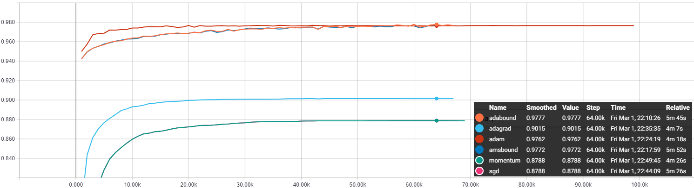

# AdaBound in Tensorflow
An optimizer that trains as fast as Adam and as good as SGD in Tensorflow

This repo is based on pytorch impl [original repo](https://github.com/Luolc/AdaBound)

[](https://lgtm.com/projects/g/kozistr/AdaBound-tensorflow/alerts/)
[](https://lgtm.com/projects/g/kozistr/AdaBound-tensorflow/context:python)

## Explanation
An optimizer that trains as fast as Adam and as good as SGD, 
for developing state-of-the-art deep learning models on a wide variety of popular tasks in the field of CV, NLP, and etc.

Based on Luo et al. (2019). [Adaptive Gradient Methods with Dynamic Bound of Learning Rate](https://openreview.net/forum?id=Bkg3g2R9FX). In Proc. of ICLR 2019.

## Requirement
* Python 3.x
* Tensorflow 1.x (maybe for 2.x)

## Usage

```python
# learning can be either a scalar or a tensor

# use exclude_from_weight_decay feature, 
# if you wanna selectively disable updating weight-decayed weights

optimizer = AdaBoundOptimizer(
    learning_rate=1e-3,
    final_lr=1e-1,
    beta_1=0.9,
    beta_2=0.999,
    gamma=1e-3,
    epsilon=1e-6,
    amsbound=False,
    decay=0.,
    weight_decay=0.,
    exclude_from_weight_decay=["..."]
)
```

You can simply test the optimizers on MNIST Dataset w/ below model!

For `AdaBound` optimizer,
```python
python3 mnist_test --optimizer "adabound"
```

For `AMSBound` optimizer,
```python
python3 mnist_test --optimizer "amsbound"
```

## Results

Testing Accuracy & Loss among the optimizers on the several data sets w/ under same condition.

### MNIST DataSet



*Optimizer* | *Test Acc* | *Time* | *Etc* |
:---: | :---: | :---: | :---: |
AdaBound | **97.77%** | 5m 45s |  |
AMSBound | 97.72% | 5m 52s |  |
Adam | 97.62% | 4m 18s |  |
AdaGrad | 90.15% | **4m 07s** |  |
SGD | 87.88% | 5m 26s | |
Momentum | 87.88% | 4m 26s | w/ nestrov |

## Citation

```
@inproceedings{Luo2019AdaBound,
  author = {Luo, Liangchen and Xiong, Yuanhao and Liu, Yan and Sun, Xu},
  title = {Adaptive Gradient Methods with Dynamic Bound of Learning Rate},
  booktitle = {Proceedings of the 7th International Conference on Learning Representations},
  month = {May},
  year = {2019},
  address = {New Orleans, Louisiana}
}
```

## Author

Hyeongchan Kim / [kozistr](http://kozistr.tech)
